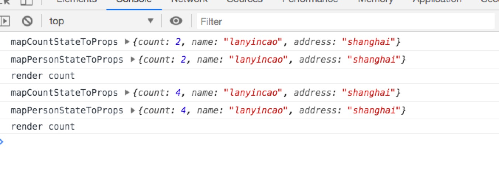

如何高效的使用 `context`, [上一篇文章](https://lanyincao.netlify.com/posts/2019-08-19/form/) 详细的讲述了如何写一个 `Form`, 以及如何改造 `Form` 的性能。那么是否同样的
写法也可以运用于普通组件呢？

# 回顾 context

[在 context 文章中](https://lanyincao.netlify.com/posts/2019-08-10/context/)讲了具体的用法, 同时也讲了 `Hook` 中和 `Class` 中使用 `Context` 的区别。同时也说过在使用 `Context` 的
一些问题。这样的问题该如何去解决呢？在 `Form` 中的方案是否可以复用到其他普通的组件中呢？

# react-redux

[react-redux](https://github.com/reduxjs/react-redux) 是由 [redux](https://github.com/reduxjs/redux) 延伸出来的，用于 react 中的状态管理库，状态管理在 `2018` 年是非常非常的火，同时
也延伸出了一大批状态管理的库比如 [mobx](https://github.com/mobxjs/mobx), [dva](https://github.com/dvajs/dva) 等等都是非常优秀的库。`react-redux` 在很多项目中都使用了这个库。那么这个库是否存在同样的
问题呢？不妨用一个简单的 demo 来看一下。

`react-redux-demo`

从 `console.log` 中可以看出在修改 count 的时候只有 `Count` 组件更新，在修改 `person` 的时候只有 `Person` 组件更新。因为无论是 `Count` 还是 `Person`，
都在自己所需要的 `props` 发生变化的时候才会更新。这个是符合 `React` 的正常的数据流的，组件的 `props` 变化会让组件发生更新。

那么是否 `connect` 每次都会执行呢？`connect` 是一个 `HOC`, 会返回新的组件，那不妨在 `mapStateToProps` 中加入 `console.log`

`mapCountStateToProps`

```js
function mapCountStateToProps(state) {
  console.log('mapCountStateToProps', state);
  const { count } = state;
  return { count };
}
```

`mapPersonStateToProps`

```js
function mapPersonStateToProps(state) {
  console.log('mapPersonStateToProps', state);
  const { name, address } = state;
  return { name, address };
}
```

`Count`

```js
class Count extends React.Component<any, any> {
  render() {
    const { dispatch } = this.props;
    console.log('render count');
    return (
      <div>
        <div>count: {this.props.count}</div>
        <button onClick={() => dispatch({ type: 'increase', payload: 2 })}>
          increase
        </button>
        <button onClick={() => dispatch({ type: 'decrease', payload: 2 })}>
          decrease
        </button>
      </div>
    );
  }
}
```

`Person`

```js
class Person extends React.Component<any> {
  render() {
    const { dispatch, name, address } = this.props;
    console.log('render person');
    return (
      <div>
        <div>
          <span>name: {name}</span>
          <span style={{ marginLeft: 20 }}>address: {address}</span>
        </div>
        <div>
          <button
            onClick={() => dispatch({ type: 'updateName', payload: '牧云云' })}
          >
            updateName
          </button>
          <button
            onClick={() =>
              dispatch({ type: 'updateAddress', payload: 'hangzhou' })
            }
          >
            updateAddress
          </button>
        </div>
      </div>
    );
  }
}
```

点击 `increase` 或者 `decrease` 按钮，看一下控制台

<div>
  
</div>

仔细观察下发现 `render count` 是正常的渲染，因为点击了 `increase` 或者 `decrease`, 但是 `mapCountStateToProps` 以及
`mapPersonStateToProps` 每次都会被输出，即使只更新了 `count` 组件的 `props`, 其实这个大家不同太过于关心，我之前在 `twitter` 上
问过 `Dan`, 关于渲染次数的问题， `Dan` 的回答就是不要太过在意 `render` 次数这是内部的实现细节了。那这个地方会有影响吗？

`connect` 只是一个普通的高阶组件，不妨看一下 `connect` 的源码

```js
export function createConnect({
  connectHOC = connectAdvanced,
  mapStateToPropsFactories = defaultMapStateToPropsFactories,
  mapDispatchToPropsFactories = defaultMapDispatchToPropsFactories,
  mergePropsFactories = defaultMergePropsFactories,
  selectorFactory = defaultSelectorFactory
} = {}) {
  return function connect(
    mapStateToProps,
    mapDispatchToProps,
    mergeProps,
    {
      pure = true,
      areStatesEqual = strictEqual,
      areOwnPropsEqual = shallowEqual,
      areStatePropsEqual = shallowEqual,
      areMergedPropsEqual = shallowEqual,
      ...extraOptions
    } = {}
  ) {
    const initMapStateToProps = match(
      mapStateToProps,
      mapStateToPropsFactories,
      'mapStateToProps'
    );
    const initMapDispatchToProps = match(
      mapDispatchToProps,
      mapDispatchToPropsFactories,
      'mapDispatchToProps'
    );
    const initMergeProps = match(mergeProps, mergePropsFactories, 'mergeProps');

    return connectHOC(selectorFactory, {
      // used in error messages
      methodName: 'connect',

      // used to compute Connect's displayName from the wrapped component's displayName.
      getDisplayName: name => `Connect(${name})`,

      // if mapStateToProps is falsy, the Connect component doesn't subscribe to store state changes
      shouldHandleStateChanges: Boolean(mapStateToProps),

      // passed through to selectorFactory
      initMapStateToProps,
      initMapDispatchToProps,
      initMergeProps,
      pure,
      areStatesEqual,
      areOwnPropsEqual,
      areStatePropsEqual,
      areMergedPropsEqual,

      // any extra options args can override defaults of connect or connectAdvanced
      ...extraOptions
    });
  };
}
```

`connect` 本身不会有一些复杂的计算，所以即使每次都执行是没有影响的。

`有可能你特别在意 render 的次数，可能就是不想 connect 每次都要执行，就是有这样的强迫症，那么应该如何去修改这个呢？`

---

# 从零实现一个状态管理

在开始这个部分之前，首先要比较熟悉 `redux`, 因为这部分很多代码都是继续沿用 `redux` 中的代码。

一步一步的来，首先对于状态管理，应该需要一个 `Provider`, 不妨来实现这个 `Provider`, Provider 还是使用 `React` 的 `context api`,
这个实现是使用了 `TS`, 如果对 `TS` 不熟悉的可以查看[官网](https://www.typescriptlang.org/)

`Provider`

```js
import * as React from 'react';
import { storeContext, selectorContext } from './context';
import { ProviderProps } from './type';

const { useState } = React;

export default function Provider<T>({ value, children }: ProviderProps<T>) {
  // 缓存 value 的值进行局部更新
  const [api] = useState(value);

  return (
    <storeContext.Provider value={value}>
      <selectorContext.Provider value={api}>
        {children}
      </selectorContext.Provider>
    </storeContext.Provider>
  );
}
```

在 `Provider` 中使用了两个 `context`, 为什么要使用两个一模一样的呢？后面会详细解释, 在看一下 `context` 的声明

```js
import * as React from 'react'
import { UseStoreResult } from './type'

export const storeContext = React.createContext<UseStoreResult<any> | undefined>(undefined)

/**
 * selectorContext 用户获取值并且可以和 dispatch 相应的值 这个可以进行缓存所以真正存储只的地方是 storeContext
 */
export const selectorContext = React.createContext<UseStoreResult<any> | undefined>(undefined)
```

这些类型的地方为了方便快速直接用 `any` 来代替, 可以看出，在 `context` 中声明了两个 `context`, 在 `Provider` 中使用了
这两个 `context`。

因为整个部分都是采用 `Hooks` 的方式来开发的，所以不再命名为 `createStore` 所以采用 `useStore`。

```js
export default function useStore<T extends object>(
  reducer: ReducerType<T>,
  initialState?: T,
  enhancer?: any
): UseStoreResult<T> {
  const [get, set] = useCurrent(initialState || {})
  const listeners = useRef<Listener[]>([])

  // 继续使用 redux 中的中间件
  if (
    (typeof initialState === 'function' && typeof enhancer === 'function') ||
    (typeof enhancer === 'function' && typeof arguments[3] === 'function')
  ) {
    throw new Error(
      'It looks like you are passing several store enhancers to ' +
        'useStore(). This is not supported. Instead, compose them ' +
        'together to a single function.'
    )
  }

  if (typeof initialState === 'function' && typeof enhancer === 'undefined') {
    enhancer = initialState
    initialState = undefined
  }

  if (typeof enhancer !== 'undefined') {
    if (typeof enhancer !== 'function') {
      throw new Error('Expected the enhancer to be a function.')
    }

    return enhancer(useStore)(reducer, initialState)
  }

  /**
   * 返回 store 存的所有的 state
   */
  const getState = () => get() as T

  /**
   * 监听器用于更新子组件
   * @param listener
   */
  const subscriber = (listener: Listener) => {
    if (typeof listener !== 'object') {
      throw new Error('expected listener to be a object')
    }

    // 加入到监听器中
    listeners.current.push(listener)

    return () => {
      const index = listeners.current.indexOf(listener)
      listeners.current.splice(index, 1)
    }
  }

  /**
   * 用于修改值, 用于中间件的时候可以不传第二个值，但是在 selector 中仍然需要
   * @param action
   * @param deps 可能不存在，如果不存在则全部更新
   */
  const dispatch = (action: Action, deps?: string[]) => {
    const oldState = get()
    // 获取到执行后的 state
    const state = reducer(oldState as T, action)
    set(state)

    const changeKeys: string[] = []

    // 进行浅比较获取到修改的值
    if (deps) {
      deps.forEach(key => {
        const oldValue = getPath(oldState, key)
        const newValue = getPath(state, key)
        if (oldValue !== newValue) {
          changeKeys.push(key)
        }
      })
    }

    // 遍历监听器，只对变化的组件进行更新
    listeners.current.forEach(listener => {
      const listenerProps = listener.props
      // 如果依赖存在则更新依赖中的选项，如果不存在则更新全部
      if (deps) {
        // 遍历监听器，对修改的部分进行更新
        for (let i = 0; i < changeKeys.length; i++) {
          if (listenerProps.indexOf(changeKeys[i]) > -1) {
            listener.listener()
          }
        }
      } else {
        listener.listener()
      }
    })

    return action
  }

  return {
    getState: getState,
    subscriber: subscriber,
    dispatch: dispatch
  }
}
```

`useStore` 前面的部分和 `redux` 中的代码完全一样，所以这个地方暂时可以不看, `subscriber` 部分也基本没有什么变化，但是
还是要看一下 `listener` 的参数是什么样子的。

```js
const subscriber = (listener: Listener) => {
  if (typeof listener !== 'object') {
    throw new Error('expected listener to be a object')
  }

  // 加入到监听器中
  listeners.current.push(listener)

  return () => {
    const index = listeners.current.indexOf(listener)
    listeners.current.splice(index, 1)
  }
}

export interface Listener {
  listener: () => any
  props: any[]
}
```

可以看定义的接口，`subscriber` 的参数是一个对象，对象中包括 `listener` 函数和一个 `props`, 具体用法这两个是干什么用的, 后面会讲到

在看 `dispatch` 这个函数， `dispatch` 是主体的部分， `dispatch` 接受了两个参数，第一个参数是 `action` 第二个参数是一个 `deps` 依赖数组
那么这里为什么需要这样的一个依赖项呢？在看下 `useSelector`

`useSelector` 是最最最主要的部分，也是最关键的部分，在业务代码中，只需要使用 `useSelector` 就能实现`局部渲染`

```js
export default function useSelector<T>(
  callback: (state: T) => any[]
): UseSelectorResult<T> {
  const api = useContext(selectorContext);
  const forceUpdate = useForceUpdate();

  if (!api) {
    throw new Error('expected useSelector to be used in Provider');
  }

  const propsRef = React.useRef(callback(api.getState()));
  // 获取到返回的 props
  const props = callback(api.getState());

  if (!isSame(propsRef.current, props)) {
    propsRef.current = props;
  }

  const current = propsRef.current;

  useEffect(() => {
    // 订阅需要的信息
    api.subscriber({
      listener: () => forceUpdate(false),
      props: current
    });
  }, [api, forceUpdate, current]);

  return {
    dispatch: (action: Action) => {
      api.dispatch(action, props);
      return action;
    },
    getState: api.getState
  };
}
```

`useSelector` 使用了 `selectorContext`，而不是 `storeContext`, 为什么？因为只要 `store` 发生变化，那么 `storeContext` 必然会
重新 `render`, `storeContext` 重新 `render`, 使用 `storeContext` 的地方都会重新 `render`, 那么为什么 `selectorContext` 不会呢？
在会有看下 `Provider` 的代码

```js
export default function Provider<T>({ value, children }: ProviderProps<T>) {
  // 缓存 value 的值进行局部更新
>  const [api] = useState(value); 🤔

  return (
    <storeContext.Provider value={value}>
      <selectorContext.Provider value={api}>
        {children}
      </selectorContext.Provider>
    </storeContext.Provider>
  );
}
```

箭头所指的这个部分就是关键所在 `const [api] = useState(value)` 通过这样，把 `value` 进行缓存了，这样即使每次 `render`,
此时的 `api` 都是相同的。也就不会造成使用 `selectorContext` 的地方的就会更新。

那么如果 `useSelector` 不更新那在业务代码中使用 `useSelector()` 不也不更新了吗？这样就会造成 bug 的产生，这是万万不允许的。
所以在 `useSelector` 内部使用了 `useForceUpdate`。

`useForceUpdate`

```js
function forceReducer(state: boolean) {
  return !state;
}

/**
 * forceUpdate
 */
export function useForceUpdate() {
  return React.useReducer(forceReducer, false)[1];
}
```

现在可以看到在 `useSelector` 内部的 `useEffect`

```js
const propsRef = React.useRef(callback(api.getState()));
// 获取到返回的 props
const props = callback(api.getState());

if (!isSame(propsRef.current, props)) {
  propsRef.current = props;
}

const current = propsRef.current;

useEffect(() => {
  // 订阅需要的信息
  api.subscriber({
    listener: () => forceUpdate(false),
    props: current
  });
}, [api, forceUpdate, current]);
```

只有在 `current` 变化的时候会再一次重新注册 `listener`, 这个 `current` 通过调用 `callback(api.getState())` 所得，
也就是只有在 `useSelector` 的依赖发生变化的时候才会重新注册。在业务里可以这样使用 `useSelector(() => ['a', 'b'])` 这里的
`a` 和 `b` 都是使用 `useSelector` 组件里需要使用到的值。把使用的值作为依赖，只要使用的值发生改变的时候，才会进行 `render`。

在看下 `useSelector` 的返回值

```js
return {
  dispatch: (action: Action) => {
    api.dispatch(action, props);
    return action;
  },
  getState: api.getState
};
```

此时的返回值接管了 `store` 中的 `dispatch` 函数, dispatch 的第二个参数也是 `useSelector` 的依赖项，所以在每次执行 `dispatch` 的时候都会
执行 `selector` 的 `dispatch`， 然后调用 `store` 中的 `dispatch` 。在回头看下 `store` 中的 `dispatch`

```js
/**
 * 用于修改值, 用于中间件的时候可以不传第二个值，但是在 selector 中仍然需要
 * @param action
 * @param deps 可能不存在，如果不存在则全部更新
 */
const dispatch = (action: Action, deps?: string[]) => {
  const oldState = get()
  // 获取到执行后的 state
  const state = reducer(oldState as T, action)
  set(state)

  const changeKeys: string[] = []

  // 进行浅比较获取到修改的值
  if (deps) {
    deps.forEach(key => {
      const oldValue = getPath(oldState, key)
      const newValue = getPath(state, key)
      if (oldValue !== newValue) {
        changeKeys.push(key)
      }
    })
  }

  // 遍历监听器，只对变化的组件进行更新
  listeners.current.forEach(listener => {
    const listenerProps = listener.props
    // 如果依赖存在则更新依赖中的选项，如果不存在则更新全部
    if (deps) {
      // 遍历监听器，对修改的部分进行更新
      for (let i = 0; i < changeKeys.length; i++) {
        if (listenerProps.indexOf(changeKeys[i]) > -1) {
          listener.listener()
        }
      }
    } else {
      listener.listener()
    }
  })

  return action
}
```

首先根据 `deps` 找出哪些是修改的值，因为一个组件有可能会有许多依赖项，但是在这个组件中只修改了使用的 `a`, `b` 没有改变， 那么其他组件依赖了这个 `b` 也
不应该更新，所以需要找出改变的依赖项

```js
if (deps) {
  deps.forEach(key => {
    const oldValue = getPath(oldState, key);
    const newValue = getPath(state, key);
    if (oldValue !== newValue) {
      changeKeys.push(key);
    }
  });
}
```

找出改变的依赖项后，对 `listeners` 进行遍历, 找出所有使用了 `useSelector` 的地方的所有依赖，看是否存在其他的依赖项也包括这次改变的依赖项，比如此时更改了
`a`, 那么所有其他组件中有对 `a` 的依赖项的都应该进行重新 `render`。这也是 `store` 中 `dispatch` 的主要逻辑。

基本上一个状态管理的所有代码已经讲清楚了，那么不妨试试。

点击 `increase` 或者 `decrease`, 只打印出了 `render count selector` 所以每次 `useSelector` 也只是单次渲染。这个也是局部渲染了。

<div>
  
</div>

最后贴一下代码，代码也可以在[这里找到](https://github.com/snakeUni/lanyincaos.cn/tree/master/src/pages/posts/2019-08-24-how-to-use-context-efficient)

`react-redux-demo`

```js
import * as React from 'react';
import { Provider, connect } from 'react-redux';
import { createStore } from 'redux';

// 一个简单的 reducer
function reducer(state, action) {
  switch (action.type) {
    case 'increase': {
      return { ...state, count: state.count + action.payload };
    }

    case 'decrease': {
      return { ...state, count: state.count - action.payload };
    }

    case 'updateName': {
      return { ...state, name: action.payload };
    }

    case 'updateAddress': {
      return { ...state, address: action.payload };
    }
    default: {
      return state;
    }
  }
}

const store = createStore(reducer, {
  count: 0,
  name: 'lanyincao',
  address: 'shanghai'
});
class App extends React.Component {
  render() {
    return <Provider store={store}>{this.props.children}</Provider>;
  }
}

function mapCountStateToProps(state) {
  console.log('mapCountStateToProps', state);
  const { count } = state;
  return { count };
}

class Count extends React.Component<any, any> {
  render() {
    const { dispatch } = this.props;
    console.log('render count');
    return (
      <div>
        <div>count: {this.props.count}</div>
        <button onClick={() => dispatch({ type: 'increase', payload: 2 })}>
          increase
        </button>
        <button onClick={() => dispatch({ type: 'decrease', payload: 2 })}>
          decrease
        </button>
      </div>
    );
  }
}

function mapPersonStateToProps(state) {
  console.log('mapPersonStateToProps', state);
  const { name, address } = state;
  return { name, address };
}

class Person extends React.Component<any> {
  render() {
    const { dispatch, name, address } = this.props;
    console.log('render person');
    return (
      <div>
        <div>
          <span>name: {name}</span>
          <span style={{ marginLeft: 20 }}>address: {address}</span>
        </div>
        <div>
          <button
            onClick={() => dispatch({ type: 'updateName', payload: '牧云云' })}
          >
            updateName
          </button>
          <button
            onClick={() =>
              dispatch({ type: 'updateAddress', payload: 'hangzhou' })
            }
          >
            updateAddress
          </button>
        </div>
      </div>
    );
  }
}

// count
const ConnectCount = connect(mapCountStateToProps)(Count);
// person
const ConnectPerson = connect(mapPersonStateToProps)(Person);

export default function Demo() {
  return (
    <div>
      <App>
        <ConnectCount />
        <ConnectPerson />
      </App>
    </div>
  );
}
```

`react-redux-chaos demo`

```js
import * as React from 'react';
import { useStore, Provider, useSelector } from 'react-redux-chaos';

const initialState = { count: 0, name: 'lanyincao', address: 'shanghai' };

function reducer(state, action) {
  switch (action.type) {
    case 'increase': {
      return { ...state, count: state.count + action.payload };
    }

    case 'decrease': {
      return { ...state, count: state.count - action.payload };
    }

    case 'updateName': {
      return { ...state, name: action.payload };
    }

    case 'updateAddress': {
      return { ...state, address: action.payload };
    }
    default: {
      return state;
    }
  }
}

function App({ children }) {
  const store = useStore(reducer, initialState);
  return <Provider value={store}>{children}</Provider>;
}

function Count() {
  const { getState, dispatch } = useSelector(() => {
    console.log('render count selector');
    return ['count'];
  });

  const state: any = getState();
  return (
    <div>
      <div>count: {state.count}</div>
      <button onClick={() => dispatch({ type: 'increase', payload: 2 })}>
        increase
      </button>
      <button onClick={() => dispatch({ type: 'decrease', payload: 2 })}>
        decrease
      </button>
    </div>
  );
}

function Person() {
  const { getState, dispatch } = useSelector(() => {
    console.log('render person selector');
    return ['name', 'address'];
  });

  const state: any = getState();

  return (
    <div>
      <div>
        <span>name: {state.name}</span>
        <span style={{ marginLeft: 20 }}>address: {state.address}</span>
      </div>
      <div>
        <button
          onClick={() => dispatch({ type: 'updateName', payload: '牧云云' })}
        >
          updateName
        </button>
        <button
          onClick={() =>
            dispatch({ type: 'updateAddress', payload: 'hangzhou' })
          }
        >
          updateAddress
        </button>
      </div>
    </div>
  );
}

export default function Demo() {
  return (
    <App>
      <Count />
      <Person />
    </App>
  );
}
```

# conclusion

`context` 用法很简单，当想要业务逻辑分离的时候可以尝试使用多个 `context` 能做到减少更新的作用。也可以使用 `useMemo` 等相关的 `api`,
比较在乎 `render` 次数的话，可以采用 `react-redux` 一些成熟的库，或者 [react-redux-chaos](https://github.com/snakeUni/react-redux-chaos)
